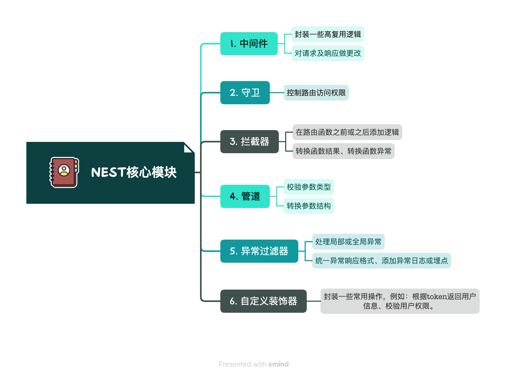
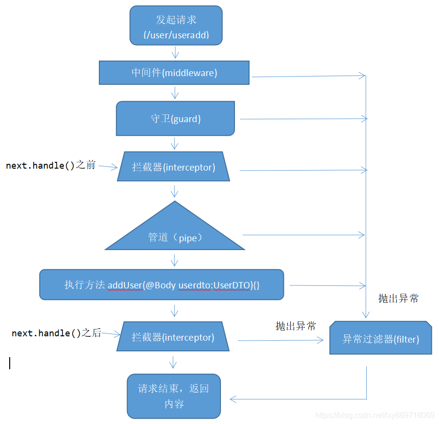

- [1.核心模块](#1核心模块)
  - [1.1中间件](#11中间件)
    - [注册中间件](#注册中间件)
    - [函数式中间件](#函数式中间件)
    - [多个中间件](#多个中间件)
  - [1.2守卫](#12守卫)
  - [1.3拦截器](#13拦截器)
    - [在函数前后添加逻辑](#在函数前后添加逻辑)
    - [注册拦截器](#注册拦截器)
  - [1.4管道](#14管道)
    - [内置管道](#内置管道)
    - [转换参数](#转换参数)
    - [校验参数](#校验参数)
  - [1.5异常过滤器](#15异常过滤器)
  - [1.6中间件、守卫、拦截器、管道、异常过滤器的执行顺序](#16中间件守卫拦截器管道异常过滤器的执行顺序)
  - [1.7自定义装饰器](#17自定义装饰器)
    - [结合管道使用](#结合管道使用)
    - [装饰器聚合](#装饰器聚合)
- [2.其他](#2其他)
  - [2.1编程概念](#21编程概念)
    - [ioC 控制反转](#ioc-控制反转)
    - [DTOs 限制参数类型](#dtos-限制参数类型)
  - [2.2规范](#22规范)
    - [从文件夹的index导入类，而不是各个文件](#从文件夹的index导入类而不是各个文件)
  - [2.3CLI](#23cli)
  - [2.4部署](#24部署)

# 1.核心模块



## 1.1中间件

> 中间件：路由处理前调用的函数。常用于封装一些高复用逻辑、对请求及响应做更改

中间件要实现 `NestMiddleware` 接口

```js
import { Injectable, NestMiddleware } from '@nestjs/common';
import { Request, Response, NextFunction } from 'express';

@Injectable()
export class LoggerMiddleware implements NestMiddleware {
  use(req: Request, res: Response, next: NextFunction) {
    console.log('Request...');
    next();
  }
}
```

通常中间件需执行 `next()` 执行下一个中间件，又或者响应请求，如果都没有则请求会被挂起。

### 注册中间件

**局部注册**

```js
import { Module, NestModule, MiddlewareConsumer } from '@nestjs/common';
import { LoggerMiddleware } from './common/middleware/logger.middleware';
import { CatsModule } from './cats/cats.module';

@Module({
  imports: [CatsModule],
})
export class AppModule implements NestModule {
  configure(consumer: MiddlewareConsumer) {
    consumer
      .apply(LoggerMiddleware)
      .forRoutes('cats');
  }
}
```

`apply()` 方法也可以使用多个参数来指定多个多个中间件。

`forRoutes()` 通常会传递一个由逗号分隔的控制器列表。它还可接受一个字符串、多个字符串、对象、一个控制器类甚至多个控制器类。

**全局注册**

全局注册后会绑定到每个路由

```js
const app = await NestFactory.create(AppModule);
app.use(logger);
await app.listen(3000);
```

### 函数式中间件

当一个中间件不依赖其他中间件时，那可以使用函数式中间件，编写起来更加简单。

```js
export function logger(req, res, next) {
  console.log(`Request...`);
  next();
}
```

**注册**

```js
consumer.apply(logger).forRoutes(CatsController);
```

### 多个中间件

`apply` 中的中间件按从左到右依次执行

```js
consumer.apply(cors(), helmet(), logger).forRoutes(CatsController);
```

## 1.2守卫

> 守卫用于控制路由访问权限

守卫是一个实现 `CanActivate` 接口的类，在触发路由前会先触发守卫。

```js
import { Injectable, CanActivate, ExecutionContext } from '@nestjs/common';
import { Observable } from 'rxjs';

@Injectable()
export class AuthGuard implements CanActivate {
  canActivate(
    context: ExecutionContext,
  ): boolean | Promise<boolean> | Observable<boolean> {
    return true
  }
}
```

`canActivate` 中若返回 false，框架会抛出一个 ForbiddenException 异常

```js
{
  "statusCode": 403,
  "message": "Forbidden resource",
  "error": "Forbidden"
}
```

若要指定异常，可在守卫中抛出指定异常，最终交给全局异常处理。

```js
throw new UnauthorizedException();
```

**局部守卫注册**

```js
@Controller('cats')
@UseGuards(new AuthGuard())
export class CatsController {}
```

**全局守卫注册**

```js
const app = await NestFactory.create(AppModule);
app.useGlobalGuards(new RolesGuard());
```

## 1.3拦截器

> 拦截器：用于在函数之前或之后添加逻辑；转换函数结果、转换函数异常

拦截器要实现 `NestInterceptor` 接口

### 在函数前后添加逻辑

`NestInterceptor.intercept` 接收2个参数，其中第2个参数 `CallHandler` 包含 `handle` 方法，调用 `handle` 方法目标函数才会被执行，`handle` 返回一个 RxJS `Observable` 。

如下实例，通过控制 `next.handle()` 调用契机，可以很轻松的添加函数前、后逻辑以及对函数返回处理、异常处理。

```js
import { Injectable, NestInterceptor, ExecutionContext, CallHandler } from '@nestjs/common';
import { Observable } from 'rxjs';
import { tap } from 'rxjs/operators';

@Injectable()
export class LoggingInterceptor implements NestInterceptor {
  intercept(context: ExecutionContext, next: CallHandler): Observable<any> {
    console.log('Before...');

    const now = Date.now();
    return next
      .handle()
      .pipe(
        tap(() => console.log(`After... ${Date.now() - now}ms`)),
      );
  }
}
```

### 注册拦截器

**局部注册**

```js
@UseInterceptors(LoggingInterceptor)
export class CatsController {}
```

**全局注册**

```js
const app = await NestFactory.create(ApplicationModule);
app.useGlobalInterceptors(new LoggingInterceptor());
```

## 1.4管道

> 管道：用于校验和转换参数。

### 内置管道

- ValidationPipe
- ParseIntPipe
- ParseFloatPipe
- ParseBoolPipe
- ParseArrayPipe
- ParseUUIDPipe
- ParseEnumPipe
- DefaultValuePipe
- ParseFilePipe

### 转换参数

```js
@Get(':id')
async findOne(@Param('id', ParseIntPipe) id: number) {
  return this.catsService.findOne(id);
}
```

### 校验参数

`validationPipe` 是nestJS中内置的数据验证管道，它结合 `class-validator` 可以很方便的处理数据校验。`class-validator` 中封装了许多数据校验方法，并且可以通过声明性验证装饰器触发校验。

注册全局验证管道

```js
app.useGlobalPipes(new ValidationPipe());
```

创建DTO

```js
import { IsNotEmpty } from "class-validator";
​
export class UserDto {
    @IsNotEmpty({ message: 'name 不允许为空' })
    name: string;
}
```

使用DTO

```js
@Controller('/api/v1')
export class UserController {
    @Post('/user')
    async createUser(@Body() body: UserDto) {
      // ...
    }
}
```

触发路由 `/api/v1/user` 前，会自动校验 `UserDto` ，参数格式不正确则进入 `catch` 环节，一般情况会在全局异常处理里将错误信息返回给前端。

前端得到响应

```js
{
    "data": {},
    "message": "name 不允许为空",
    "code": -1
}
```

## 1.5异常过滤器

> 异常过滤器：常用于处理全局异常，包括统一异常响应格式、添加异常日志或埋点。

异常过滤器需实现 `ExceptionFilter` 类。

```js
import { ExceptionFilter, Catch, ArgumentsHost, HttpException } from '@nestjs/common';
import { Request, Response } from 'express';

@Catch(HttpException)
export class HttpExceptionFilter implements ExceptionFilter {
  catch(exception: HttpException, host: ArgumentsHost) {
    const ctx = host.switchToHttp();
    const response = ctx.getResponse<Response>();
    const request = ctx.getRequest<Request>();
    const status = exception.getStatus();

    response
      .status(status)
      .json({
        statusCode: status,
        timestamp: new Date().toISOString(),
        path: request.url,
      });
  }
}
```

**全局注册**

```js
app.useGlobalFilters(new HttpExceptionFilter());
```

## 1.6中间件、守卫、拦截器、管道、异常过滤器的执行顺序



**往细了说**

1. 收到请求
1. 全局绑定的中间件
1. 模块绑定的中间件
1. 全局守卫
1. 控制层守卫
1. 路由守卫
1. 全局拦截器（控制器之前）
1. 控制器层拦截器 （控制器之前）
1. 路由拦截器 （控制器之前）
1. 全局管道
1. 控制器管道
1. 路由管道
1. 路由参数管道
1. 控制器（方法处理器）
1. 路由拦截器（请求之后）
1. 控制器拦截器 （请求之后）
1. 全局拦截器 （请求之后）
1. 异常过滤器 （路由，之后是控制器，之后是全局）
1. 服务器响应

## 1.7自定义装饰器

> 自定义装饰器：用于封装一些常用操作，例如根据token返回用户信息、校验用户权限。

封装获取用户信息的装饰器

```js
// user.decorator.ts

import { createParamDecorator, ExecutionContext } from '@nestjs/common';

export const User = createParamDecorator((data: unknown, ctx: ExecutionContext) => {
  const request = ctx.switchToHttp().getRequest();
  return request.user;
});
```

使用

```js
@Get()
async findOne(@User() user: UserEntity) {
  console.log(user);
}
```

### 结合管道使用

```js
@Get()
async findOne(@User(new ValidationPipe({ validateCustomDecorators: true })) user: UserEntity) {
  console.log(user);
}
```

> 请注意，validateCustomDecorators 选项必须设置为 true。默认情况下，ValidationPipe 不验证使用自定义装饰器注释的参数。

### 装饰器聚合

通过 `applyDecorators` api实现聚合

```js
import { applyDecorators } from '@nestjs/common';

export function Auth(...roles: Role[]) {
  return applyDecorators(
    SetMetadata('roles', roles),
    UseGuards(AuthGuard, RolesGuard),
    ApiBearerAuth(),
    ApiUnauthorizedResponse({ description: 'Unauthorized"' })
  );
}
```

使用 `@Auth() 自定义装饰器` 

```js
@Get('users')
@Auth('admin')
findAllUsers() {}
```

# 2.其他

## 2.1编程概念

nestJS结合了 OOP （面向对象编程）、FP （函数式编程）和 FRP （函数响应式编程）。

### ioC 控制反转

控制反转（Inversion of Control，缩写为 IoC）是面向对象编程中的一种设计原则，可以用来降低计算机代码之间的耦合度。其中最常见的方式叫做依赖注入（Dependency Injection，简称DI），还有一种方式叫“依赖查找”（Dependency Lookup）。通过控制反转，对象在被创建的时候，由一个调控系统内所有对象的外界实体将其所依赖的对象的引用传递给它。也可以说，依赖被注入到对象中。

### DTOs 限制参数类型

DTOs 即数据传输对象，有点类似 ts 的 interface


## 2.2规范

### 从文件夹的index导入类，而不是各个文件

## 2.3CLI

用指令生成模块文件

```bash
# 创建完整模块
nest g resource posts

# 创建 posts.module.ts
nest g mo posts
# 创建 posts.controller.ts
nest g co posts
# posts.service.ts
nest g service posts
```

## 2.4部署

1.ci 打包

```js
  npm i
  npm run build
```

2.Docker拷贝 `dist` 、`node_modules` 文件夹，并启动

```js
  npm run start:prod
```
